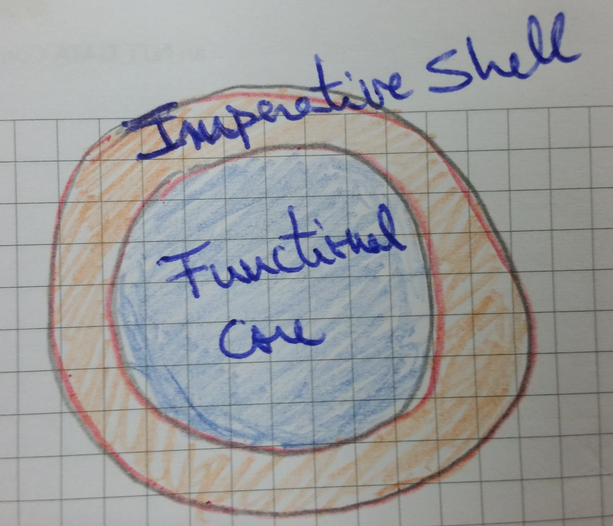

# reffectory

## Driven by events and using effects and coeffects to keep event handlers pure.
A Clojure/ClojureScript framework designed to provide a full events system with effects
and coeffects inspired by [re-frame](https://github.com/Day8/re-frame)'s one.

reffectory is the core of [re-om](https://github.com/GreenPowerMonitor/re-om),
the library we're using to introduce [re-frame's event-driven architecture](https://github.com/Day8/re-frame#why-should-you-care)
into a legacy ClojureScript application that uses [Om](https://github.com/omcljs/om).

We extracted reffectory from re-om and made it also work for Clojure in the hope that more people
might find it interesting to build Clojure and ClojureScript libraries and/or applications on top of it.

The event bus provided by reffectory is synchronous.

### Using effects and coeffects to have pure event handlers.
Side-effects are inevitable, but we can still have pure event handlers.
The trick is the introduction of effects and coeffects.

* **Effects describe your program’s side-effects**, (*what your program does to the world*), whereas
* **Coeffects track your program’s side-causes and current context**, (*what your program requires from the world*).

reffectory applies what is known as the [Declarative Effects pattern](https://www.youtube.com/watch?v=6EdXaWfoslc).

In this pattern event handlers are pure functions that receive coeffects and return effects.
Something else (a language run-time, a framework, etc.) is in charge of injecting the values that the coeffects track and interpreting the effects data to actually perform the side-effects they describe.
That something else would be reffectory in this case.

### Apps using reffectory as a reduce.
We can **imagine an app that uses reffectory as a reduce**.

At any point in time, if you reduce over all the dispatched events that have happened in the app up
until that moment in time and the coeffects maps used by each of them, you’ll get the state at that time starting from the initial state.

The combining function for the reduce is the set of registered event handlers.
Those event handlers are pure functions which gives us the advantages of:

* **Local reasoning**.
* **Easier testing**.
* **Events replay-ability**.

The constraints of this architecture helps you to **easily isolate your domain logic which is comprised only by pure functions from effectful code**.
Those pure functions will form a **functional core** which **communicates with the outside using events, coeffects and effects**.

Around this **functional core** we will find a thin layer of effectful code, the **imperative shell**, comprised by effect handlers and coeffect handlers that use whatever libraries or code they need to interact with the world.

We end up with what [Gary Bernhardt](https://www.destroyallsoftware.com/screencasts) described as a [Functional Core, Imperative Shell architecture]( https://www.destroyallsoftware.com/talks/boundaries).

This architecture can be considered what [Jeff Atwood defined as **a pit of success**](https://blog.codinghorror.com/falling-into-the-pit-of-success/) because it is a design that:

> **“makes it easy to do the right things and annoying (but not impossible) to do the wrong things.”**
